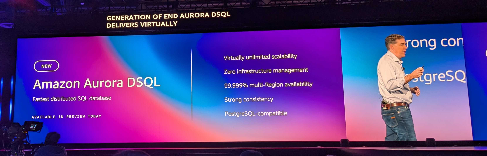

Amazon Aurora DSQL について
---


<br><br>

現地時間 2024 年 12 月 3 日に [AWS re:Invent 2024 - CEO Keynote with Matt Garman | YouTube](https://www.youtube.com/watch?v=LY7m5LQliAo) が開催され、[【 AWS re:Invent 2024 】CEO Keynote まとめ](https://www.supinf.co.jp/tech-blog/details/aws-reinvent-2024-ceo-keynote-summary/) でも紹介したとおり、多くの新サービスが発表されました。ここではその中でも [Amazon Aurora DSQL](https://aws.amazon.com/jp/rds/aurora/dsql/) について紹介します。


## Amazon Aurora DSQL とは

[Amazon Aurora DSQL](https://aws.amazon.com/jp/rds/aurora/dsql/) は、AWS が提供する PostgreSQL 互換のサーバレス分散 SQL データベースです。

### 特徴

#### 1. 事実上無制限のスケール

スケールアップからスケールダウンまで柔軟に対応し、1 秒間に数百万トランザクションから 1 日数十トランザクションまで効率的に処理可能です。

コンピュート、読み取り、書き込み、ストレージを個別にスケール可能なアーキテクチャを採用し、高い柔軟性とスケーラビリティを実現しています。

トラフィックが少ないときにはリソースをほぼゼロにまでスケールダウンすることができます。

#### 2. インフラストラクチャ管理が不要

サーバレスで運用できるため、インフラ管理やパッチ適用、フェイルオーバー操作などを意識せずに利用できます。

#### 3. VPC の外側に存在するパグリックエンドポイント

VPC 外部から直接アクセス可能なパブリックエンドポイントを提供します。これにより、VPC 内でのリソース管理が不要となり、サーバレス環境やエッジコンピューティング環境からのアクセスが容易です。

#### 4. PostgreSQL 互換

PostgreSQL プロトコル互換の SQL エンジンを搭載しているため、一般的な PostgreSQL クラアントや ORM をそのまま利用可能です。ただし、認証は IAM を使用したトークンベースの認証のみのサポートになります。

#### 5. シングルリージョン/マルチリージョン構成対応

シングルリージョン構成では高い可用性 (99.99%) を、マルチリージョン構成ではグローバルな Active/Active 書き込みと読み取りを実現し、高い可用性 (99.999%) と耐障害性を備えます。

#### 6. OCC (Optimistic Concurrency Control) による低遅延・高スループット

OCC を採用しており、トランザクションはコミット時にのみ整合性チェックを行います。そのため、ロック待ちやグローバルなロックサーバへのアクセスが不要になり、スケールアウトに伴うロック競合による性能低下を避けています。

#### 7. Active/Active 分散アーキテクチャ

全てのリージョン、AZ で同時に読み書きが行えるため、地理的に分散したユーザへ低レイテンシ・高スループットのアクセスを提供すること可能です。

#### 8. RDS Proxy では不十分だった課題への対応

従来、サーバレス環境で RDS を利用する際には [Amazon RDS Proxy](https://aws.amazon.com/jp/rds/proxy/) が接続管理やスケーリングの問題を部分的に緩和してきましたが、完全な解決には至っていませんでした。

[Amazon Aurora DSQL](https://aws.amazon.com/jp/rds/aurora/dsql/) はこの問題を解消し、サーバレス環境に真にマッチした、完全な分散型でスケールアウト可能なリレーショナルデータベースとなっています。


## アーキテクチャ

### 内部アーキテクチャ

[Amazon Aurora DSQL](https://aws.amazon.com/jp/rds/aurora/dsql/) は以下のような要素で構成されています。

<div style="text-align:center">
  <div>
    
  </div>
  <a href="https://www.youtube.com/watch?v=huGmR_mi5dQ" target="_blank">Deep dive into Amazon Aurora DSQL and its architecture (YouTube)</a> の現地写真
</div><br>

読み取り、書き込み時の動作は以下のとおりです。

<div style="text-align:center">
  <div>
    
  </div>
  <a href="https://www.youtube.com/watch?v=huGmR_mi5dQ" target="_blank">Deep dive into Amazon Aurora DSQL and its architecture (YouTube)</a> の現地写真
</div><br>

<div style="text-align:center">
  <div>
    
  </div>
  <a href="https://www.youtube.com/watch?v=huGmR_mi5dQ" target="_blank">Deep dive into Amazon Aurora DSQL and its architecture (YouTube)</a> の現地写真
</div><br>

それぞれの要素について見ていきましょう。

#### 1. Query Processor (QP)

<div style="text-align:center">
  <div>
    
  </div>
  <a href="https://www.youtube.com/watch?v=huGmR_mi5dQ" target="_blank">Deep dive into Amazon Aurora DSQL and its architecture (YouTube)</a> の現地写真
</div><br>

PostgreSQL 互換の SQL エンジンを [Firecracker](https://github.com/firecracker-microvm/) ベースの軽量仮想マシン上で動作させています。QPs はスケール可能で、クライアントの需要に応じて動的に増減します。各トランザクションは独立した QP 上で動作し、Storage とは論理的なインターフェースで接続されます。

読み取りクエリは全てスナップショットアイソレーションで実行され、開始時点のデータ状態を忠実に参照します。書き込み操作中もコミットまではローカルで変更が保存され、コミット時にのみ分散的な整合性チェックが発生します。

#### 2. Adjudicator

トランザクションコミット時の衝突検出を行う軽量なコンポーネントです。OCC に基づくアーキテクチャにより、Adjudicator は実行中トランザクションへのロックを保持せず、コミット直前の検証で衝突を判定します。

この Adjudicator はステートレスに近く、コミット済みのトランザクションログからその状態を再構成できるため、フェイルオーバー時の再起動が容易となっています。

#### 3. Journal

トランザクションコミット時にこれを記録します。この時点でトランザクションは永続的かつ原子的にコミットされた状態となり、その後、Storage シャードが Journal を適用して最終的な状態を反映します。

この手法により、2PC (two-phase commit) や Paxos/Raft などの複雑な分散合意プロトコルなしで効率的な耐久性・可用性を実現します。

#### 4. Storage layer

分散 Journal を介し、複数の Storage シャードとレプリカによりデータを管理します。

MVCC により任意の時点でのデータビューを提供し、QPs は行単位の論理インターフェースで Storage にアクセス可能です。また、Storage layer は QP から受けた要求に対し、フィルタリングや集約などの一部の処理をプッシュダウンすることで、ネットワーク往復回数を削減しています。

### シングルリージョン構成

シングルリージョン構成では、3 つの AZ にまたがる分散 Storage とスケール可能な QP 群、Journal、Adjudicator から構成されます。

<div style="text-align:center">
  <div>
    
  </div>
  <a href="https://aws.amazon.com/jp/blogs/database/introducing-amazon-aurora-dsql/" target="_blank">Introducing Amazon Aurora DSQL</a> より引用
</div><br>

書き込みトランザクションは、分散トランザクションログにコミットされ、そのデータは 3 つの AZ にまたがるストレージレプリカに同期的で反映されます。このレプリカは、データベース性能を最大化するため、ストレージフリート全体に効率的に分散されています。

さらに、システムには自動フェイルオーバー機能が組み込まれており、コンポーネントや AZ に障害が起きた場合でも、健全なリソースへ自動的に切り替わります。その後、障害が発生したレプリカは非同期で修復され、復元が完了次第、クォーラムに再度組み込まれてクラスターの一部として利用可能になります。このプロセスにより、高い可用性と信頼性が維持されます。

### マルチリージョン構成

マルチリージョン構成では、シングルリージョン構成と同様に耐障害性と接続性を提供しながら、2 つのリージョンエンドポイントを活用することで可用性をさらに高めています。これらのリンクされたクラスターのエンドポイントは、単一の論理データベースとして機能し、データの強整合性を保ちながら同時読み書き操作を可能にします。この仕組みにより、アプリケーションは地理的位置や性能要件、耐障害性のニーズに応じて接続先を柔軟に選択でき、読み取り時には常に一貫したデータを提供します。

<div style="text-align:center">
  <div>
    
  </div>
  <a href="https://aws.amazon.com/jp/blogs/database/introducing-amazon-aurora-dsql/" target="_blank">Introducing Amazon Aurora DSQL</a> より引用
</div><br>

マルチリージョンクラスターを作成すると、[Amazon Aurora DSQL](https://aws.amazon.com/jp/rds/aurora/dsql/) は指定された別のリージョンにもクラスターを追加し、それらをリンクします。このリンクにより、コミットされた変更はすべて他のリンクされたリージョンに複製されます。そのため、いずれのクラスターからでも強整合性のある読み書きが可能になっています。

さらに、第3のリージョンが Witness リージョンとして役割を果たします。このリージョンは、リンクされたクラスターで発生したデータ変更の情報を受け取りますが、クラスターやエンドポイントは持ちません。暗号化されたトランザクションログを一時的に保持し、[Amazon Aurora DSQL](https://aws.amazon.com/jp/rds/aurora/dsql/) がマルチリージョン構成で高い耐久性と可用性を確保するために利用されます。

<div style="text-align:center">
  <div>
    
  </div>
  <a href="https://www.youtube.com/watch?v=huGmR_mi5dQ" target="_blank">Deep dive into Amazon Aurora DSQL and its architecture (YouTube)</a> の現地写真
</div><br>

内部的な要素としては、2 つのリージョンがほぼ対称的に QP や Storage、Journal を持ちます。例外として、Adjudicator リーダーは同時に１つのリージョンにしか存在しませんが、OCC によってリーダー移行はスムーズに行われます。第三の Witness リージョンは Journal 用として存在し、2-of-3 のクォーラムで耐久性と可用性を確保します。

ネットワーク分断時は、少数側リージョンは書き込み受付を停止しますが、多数側リージョンは一貫したデータ状態と書き込みを維持し続けます。これにより、強整合性を損なわずに高可用性を確保し、CAP 定理上困難とされる要件を実用的な形で実現します。

この仕組みを使うと、Active/Active でマルチリージョンにトラフィックを分散しつつ、障害時には全ユーザを健全なリージョンへスムーズに誘導できます。また、Route 53 のレイテンシベースルーティングなどと組み合わせることで、ユーザは常に低レイテンシなリージョンから強整合性のあるデータにアクセス可能となります。

### 同時実行制御

<div style="text-align:center">
  <div>
    
  </div>
</div><br>

マルチリージョンクラスターでは、ユーザーがトランザクションを送信すると、SQL 操作がトランザクションが送信されたリージョン (リージョン A) のローカルで実行されます。  
トランザクションが完了すると、そのトランザクションに関与したキーとともに事後イメージが別のリージョン (リージョン B) に送信されます。

リージョン B には、そのリージョンの現在の変更をすべて認識しているトランザクション処理リーダーがいます。  
リーダーはリージョン A から事後イメージとトランザクションに関与したキーのリストを受け取ると、それがリージョン内で現在アクティブに変更されているすべてのキーと競合していないかを確認し、競合がなければコミットの確認を送り返します。

### トランザクション分離レベル

他の分散 SQL データベースが `SERIALIZABLE` 分離レベルをサポートするのに対し、[Amazon Aurora DSQL](https://aws.amazon.com/jp/rds/aurora/dsql/) は、PostgreSQL の `REPEATABLE READ` レベルと同等のスナップショット分離を提供します。

各トランザクションは、開始時点のスナップショットからデータを読み込み、他トランザクションのコミットはコミット段階での検証時にのみ影響します。つまり、読み取り専用トランザクションでは競合検出フェーズに巻き込まれず、ブロックが発生せず高い並行実行性を保つことができます。また、書き込みトランザクションにおいてもスナップショット分離と OCC の組み合わせが、データ整合性と性能を両立しています。


## vs 他サービス

AWS には多くのデータベースサービスが存在します。それらとの比較を表などを用いて分かりやすく解説している記事がありましたので、ぜひ参考にしてみてください。

- [Aurora DSQL - A NEW boring(?) AWS Serverless Postgres compatible database](https://blog.datachef.co/aurora-dsql-a-new-boring-aws-serverless-postgres-compatible-database)

[Amazon Aurora DSQL](https://aws.amazon.com/jp/rds/aurora/dsql/) は Aurora ファミリに似た名前を持っていますが、そのアーキテクチャと動作特性はむしろ DynamoDB に近いことが分かるのではないでしょうか。

ただ、サーバレスかつスケールアウト指向であり、強整合性と高可用性を持ちながら、PostgreSQL 互換を実現しているという点で、AWS のサービスとしては新しい立ち位置のサービスと言えると思います。


## 利用時の注意点

### OCC 利用時の考慮事項

[Amazon Aurora DSQL](https://aws.amazon.com/jp/rds/aurora/dsql/) は OCC を採用しています。トランザクション中に行ロックは取得せず、コミットの段階で他のトランザクションと競合していないかを一括で確認します。そのため、クライアント側の遅延やスロークエリが他のトランザクションに影響を与えることなく、スケーラビリティと高スループットを実現しています。

ただし、この OCC を最大限に活用しつつ、安定したパフォーマンスを維持するためには、以下について考慮する必要があります。

#### 1. 競合時のリトライロジック実装

マルチリージョン構成で複数のリージョンが同じデータを同時に更新しようとした場合や、アクティブなセッション中にデータベーススキーマやカタログの変更が行われた場合、コミット時に OCC 例外が発生します。そのため、アプリケーション側でトランザクションをリトライするロジックを組み込んでおくことが重要です。

#### 2. Exponential Backoff や Jitter を用いたリトライ制御

競合が激しくリトライ率が高い場合は、リトライ間隔を指数関数的に増やしたり (Exponential Backoff) ランダムなズレを加えることで (Jitter)、 OCC 例外が続発する状況を緩和する必要があります。

#### 3. ホットスポットキー回避やスキーマ設計の工夫

特定のキーへの更新が集中するホットスポットな状況では競合が増え、パフォーマンス劣化につながります。必要に応じて、キー空間を広げたり、追記型のアーキテクチャを採用したりするなど、アプリケーション設計で競合を避ける工夫が求められます。

#### 4. スキーマ変更（DDL）の同時実行への配慮

分散環境下でスキーマやメタ情報（カタログ）が更新されると、一時的な不整合によって OCC 例外が発生する可能性があります。この場合もリトライすることで解消できますが、特に DDL 操作が並行して行われる環境ではこの種のエラーの発生率が高まるため、単一スレッドでの制御されたスキーマ変更が望まれます。

#### 5. `SELECT FOR UPDATE` の活用によるライトスキュー回避

同じデータセットを複数のトランザクションが同時に読み込み、重ならない箇所に更新を加えた場合、データセット全体としての整合性が壊れてしまうことがあります。このようなライトスキューを避けるには、`SELECT FOR UPDATE` を使用して、更新対象であることを明示することが有効です。これにより、OCC による競合検出が確実となり、データ整合性が担保しやすくなります。

これらの具体的な動作については、[Concurrency control in Amazon Aurora DSQL | AWS Database Blog](https://aws.amazon.com/jp/blogs/database/concurrency-control-in-amazon-aurora-dsql/) に SQL 文等も交えて記載されているので、気になる方は見てみてください。

### サポートされていない PostgreSQL 機能

2024 年 12 月現在ではプレビュー段階のため、PostgreSQL との互換性は今後強化されていく見込みではあるものの、現段階では PostgreSQL とは異なる部分が多く存在します。

- [Unsupported PostgreSQL features in Aurora DSQL](https://docs.aws.amazon.com/ja_jp/aurora-dsql/latest/userguide/working-with-postgresql-compatibility-unsupported-features.html)

また、`TEXT` 型の最大サイズが PostgreSQL の 1GB に対して [Amazon Aurora DSQL](https://aws.amazon.com/jp/rds/aurora/dsql/) では 1MiB など、細かな差異もあります。 

GA 時点でこれらがどれだけ解消されるかは分かりませんが、本番環境での採用を検討する際にはこれらの点を十分考慮する必要があります。


## やってみた

### 使用可能なリージョン (2024 年 12 月現在)

- us-east-1 (バージニア北部)
- us-east-2 (オハイオ)

### Cluster 作成

AWS コンソールで Aurora DSQL の画面に行き、`Create cluster` をクリックします。

<div style="text-align:center">
  <div>
    
  </div>
</div><br>

次に Cluster の設定です。見ていただければ分かるとおり、Cluster の設定としてはマルチリージョン構成に関するものと削除保護に関するものしかありません。

今回はマルチリージョン構成にするため、`Add linked Regions` のチェックをオンにし、`Linked cluster Region` をオハイオで、`Witness Region` をオレゴンで設定します。

また、検証が終わったらすぐに消すので、削除保護はオフにしています。

各項目の設定が終わったら `Create cluster` をクリックすると、Cluster の作成が始まります。

<div style="text-align:center">
  <div>
    
  </div>
</div><br>

数分待つと、作成を実行した Region および Linked Region の両方で Cluster が作成されていることを確認できます。

<div style="text-align:center">
  <div>
    <p style="text-align:left">バージニア北部：</p>
    
  </div>
</div><br>

<div style="text-align:center">
  <div>
    <p style="text-align:left">オハイオ：</p>
    
  </div>
</div><br>

Linked Region の設定を見ると、しっかりリンクされていることが分かります。

<div style="text-align:center">
  <div>
    
  </div>
</div><br>

### 接続

バージニア北部の Cluster を開き、`Connect` ボタンをクリックします。

<div style="text-align:center">
  <div>
    
  </div>
</div><br>

以下のように接続情報が表示されるので、こちらの情報をもとにお使いのクライアントツールで接続することができます。認証トークンの有効期限は 15 分となっているので注意してください（切れてしまった場合は`Connect` から再発行できます）。

今回は `admin` ユーザとして接続します。

<div style="text-align:center">
  <div>
    
  </div>
</div><br>

接続が完了したら、新しいテーブルを作成してレコードを挿入してみます。

```sql
-- テーブル作成
CREATE TABLE users(id UUID, name varchar);

-- レコード挿入
INSERT INTO users (id, name) VALUES ('11111111-1111-4111-a111-111111111111'::uuid, 'テストユーザ');

-- 確認
SELECT * FROM users;
--                  id                  |    name
-- -------------------------------------+------------
-- 11111111-1111-4111-a111-111111111111	| テストユーザ
```

次に、オハイオでも同様の手順で接続し、レコードを挿入してみます。  
オハイオからでも問題なく挿入、取得ができることが分かります。

```sql
-- レコード挿入
INSERT INTO users (id, name) VALUES ('11111111-1111-4111-a111-111111111112'::uuid, 'テストユーザ2');

-- 確認
SELECT * FROM users;
--                  id                  |    name
-- -------------------------------------+------------
-- 11111111-1111-4111-a111-111111111112	| テストユーザ2
-- 11111111-1111-4111-a111-111111111111	| テストユーザ
```


## まとめ

利用する際に考慮すべき点はあるものの、使い所によってはかなり良い選択肢になるのではないでしょうか。特に、VPC が不要でゼロスケールも可能なので、サーバレス環境との親和性が高いように感じます。

まだプレビュー段階ということもあり、PostgreSQL との互換性等で不十分な部分もありますが、今後サポートが強化されていくと思うので、動向を追っていきたいと思います。


## 参考文献

- [Amazon Aurora DSQL (preview) | AWS](https://aws.amazon.com/jp/rds/aurora/dsql/)
- [Introducing Amazon Aurora DSQL | AWS Blog](https://aws.amazon.com/jp/blogs/database/introducing-amazon-aurora-dsql/)
- [Concurrency control in Amazon Aurora DSQL | AWS Blog](https://aws.amazon.com/jp/blogs/database/concurrency-control-in-amazon-aurora-dsql/)
- [What is Amazon Aurora DSQL? | AWS User Guide](https://docs.aws.amazon.com/ja_jp/aurora-dsql/latest/userguide/what-is-aurora-dsql.html)
- [Understanding core components in Amazon Aurora DSQL | AWS User Guide](https://docs.aws.amazon.com/ja_jp/aurora-dsql/latest/userguide/what-is-core-components.html)
- [Unsupported PostgreSQL features in Aurora DSQL | AWS User Guide](https://docs.aws.amazon.com/ja_jp/aurora-dsql/latest/userguide/working-with-postgresql-compatibility-unsupported-features.html)
- [AWS re:Invent 2024 - Deep dive into Amazon Aurora DSQL and its architecture (DAT427-NEW) | AWS Events (YouTube)](https://www.youtube.com/watch?v=huGmR_mi5dQ)
- [Aurora DSQL - A NEW boring(?) AWS Serverless Postgres compatible database | DataChef](https://blog.datachef.co/aurora-dsql-a-new-boring-aws-serverless-postgres-compatible-database)
- [DSQL Vignette: Aurora DSQL, and A Personal Story | Marc's Blog](https://brooker.co.za/blog/2024/12/03/aurora-dsql.html)
- [DSQL Vignette: Reads and Compute | Marc's Blog](https://brooker.co.za/blog/2024/12/04/inside-dsql.html)
- [DSQL Vignette: Transactions and Durability | Marc's Blog](https://brooker.co.za/blog/2024/12/05/inside-dsql-writes.html)
- [DSQL Vignette: Wait! Isn’t That Impossible? | Marc's Blog](https://brooker.co.za/blog/2024/12/06/inside-dsql-cap.html)
